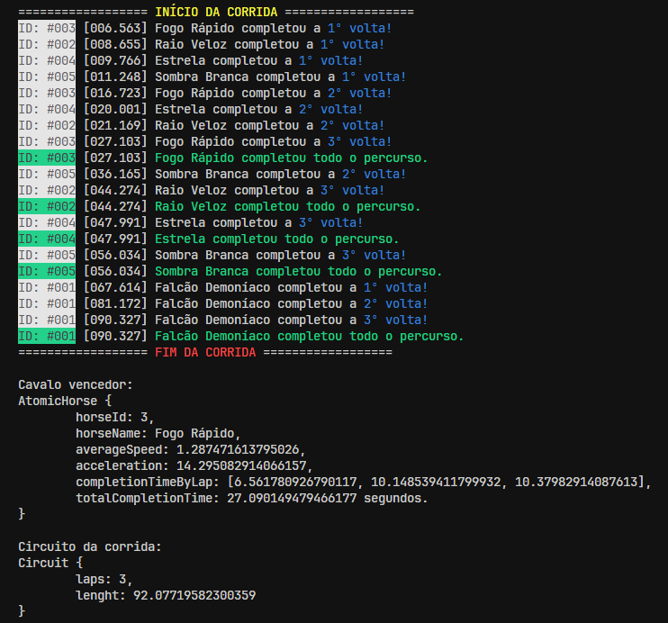

# HorseRace

Simple thread implementation to simulate a horse race with multiple horses (threads)

## Folder Structure

The workspace contains two folders by default, where:

- `src`: the folder to maintain sources
- `models`: the folder with the domain objects
- `utils`: the folder with utility classes
- `screenshots`: the folder a screenshot of the project running

Meanwhile, the compiled output files will be generated in the `bin` folder by default.

## Screenshots

